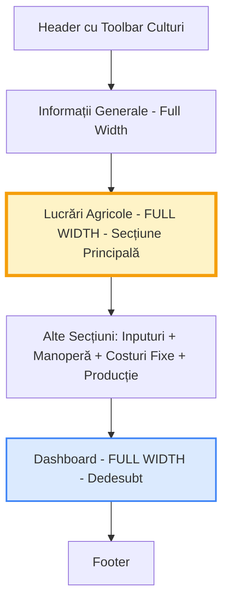

# Plan Redesign: Lucrări Agricole - Layout Full-Width

## 📋 Obiectiv
Redesign-ul paginii principale pentru a face secțiunea "Lucrări Agricole" mai largă, mai intuitivă și mai ușor de utilizat. Câmpurile importante (Data, Lucrare, Materiale) trebuie să fie foarte vizibile.

## 🎯 Cerințe Utilizator
1. **Lucrări Agricole** să ocupe toată lățimea paginii (full-width)
2. **Dashboard** să fie plasat dedesubt
3. Câmpurile să fie **vizibile și intuitive**
4. Focus pe câmpuri principale: **Data lucrării**, **Tipul lucrării**, **Materiale folosite**
5. Câmpuri secundare (Tractor, Implement, Consum motorină, etc.) pot fi mai puțin proeminente

---

## 📊 Analiza Layout-ului Actual

### Structura Curentă ([`page.tsx:398-411`](src/app/page.tsx))
```tsx
<div className="grid grid-cols-1 lg:grid-cols-2 gap-6 lg:gap-8">
  {/* Coloana stânga - Formular */}
  <div>
    <CalculatorForm ... />
  </div>
  
  {/* Coloana dreapta - Dashboard */}
  <div className="lg:sticky lg:top-24 lg:self-start">
    <Dashboard ... />
  </div>
</div>
```

### Probleme Identificate
1. ❌ Layout cu 2 coloane pe desktop limitează spațiul pentru "Lucrări Agricole"
2. ❌ Fiecare operațiune agricolă are 6+ câmpuri pe un grid comprimat (3 coloane)
3. ❌ Materialele sunt afișate într-un spațiu mic sub operațiune
4. ❌ Câmpurile sunt aglomerate și greu de citit pe ecrane mai mici

---

## 🎨 Noul Layout Propus

### Structura Vizuală (Layout Vertical)



### Avantaje
✅ Spațiu maxim pentru introducerea lucrărilor agricole  
✅ Câmpuri mai mari și mai lizibile  
✅ Dashboard vizibil dar nu interferează cu workflow-ul principal  
✅ Flow natural: setezi lucrările → vezi rezultatele

---

## 🏗️ Design Detaliat: Card Lucrare Agricolă

### Layout Card Nou (Două Niveluri)

```mermaid
graph LR
    subgraph Primary [Informații Principale - Vizibile]
        Data[📅 Data Lucrării]
        Lucrare[🚜 Tip Lucrare]
        Total[💰 Cost Total]
    end
    
    subgraph Secondary [Detalii Tehnice - Expandabil]
        Tractor[Tractor]
        Implement[Implement]
        Consum[Consum]
        Pret[Preț Motorină]
        Retributii[Retribuții]
    end
    
    subgraph Materials [Materiale - Secțiune Separată]
        Mat1[Material 1: Denumire + UM + Cantitate + Preț]
        Mat2[Material 2: ...]
        AddMat[+ Adaugă Material]
    end
    
    Primary --> Secondary
    Secondary --> Materials
    
    style Primary fill:#dcfce7,stroke:#16a34a,stroke-width:3px
    style Materials fill:#fef3c7,stroke:#f59e0b,stroke-width:2px
```



### Structura Vizuală Card

```
╔══════════════════════════════════════════════════════════════════╗
║  📅 15 Ian 2024    🚜 Dezmiristit          💰 Total: 950 lei/ha ║
║  ────────────────────────────────────────────────────────────── ║
║  🔧 Detalii Tehnice (click pentru a expanda/ascunde)             ║
║     Tractor: John Deere 6120 | Implement: Disc | Consum: 10L   ║
║     Preț motorină: 8 lei/L | Retribuții: 150 lei/ha             ║
║                                                                  ║
║  📦 MATERIALE FOLOSITE                                          ║
║  ┌────────────────────────────────────────────────────────────┐ ║
║  │ Sămânță grâu    | kg  | 220  | 2.50 lei/kg  | = 550 lei   │ ║
║  │ P35             | kg  | 150  | 2.50 lei/kg  | = 375 lei   │ ║
║  └────────────────────────────────────────────────────────────┘ ║
║  + Adaugă material                                              ║
╚══════════════════════════════════════════════════════════════════╝
```

---

## 📐 Specificații Tehnice

### 1. Layout Principal ([`page.tsx`](src/app/page.tsx))

**Modificare:**  
Schimbă grid-ul cu 2 coloane într-un layout vertical single-column

```tsx
// ÎNAINTE (2 coloane)
<div className="grid grid-cols-1 lg:grid-cols-2 gap-6 lg:gap-8">

// DUPĂ (vertical stack, full-width)
<div className="space-y-8">
  <CalculatorForm ... />  {/* Full width */}
  <Dashboard ... />        {/* Full width, dedesubt */}
</div>
```

### 2. Card Lucrare Agricolă ([`CalculatorForm.tsx`](src/components/CalculatorForm.tsx))

**Structură Nouă:**

#### Nivel 1: Header Vizibil (Primary Info)
```tsx
<div className="flex items-center justify-between p-4 bg-gradient-to-r from-green-50 to-emerald-50 border-2 border-green-200 rounded-xl">
  {/* Data - MARE și VIZIBILĂ */}
  <input type="date" className="text-lg font-bold w-48" />
  
  {/* Tip Lucrare - DROPDOWN MARE */}
  <select className="text-lg font-semibold flex-1 mx-4">
    <option>Dezmiristit</option>
    <option>Fertilizat</option>
    ...
  </select>
  
  {/* Cost Total - VIZIBIL */}
  <div className="text-xl font-bold text-green-700">
    950 lei/ha
  </div>
  
  {/* Buton Șterge */}
  <button>🗑️</button>
</div>
```

#### Nivel 2: Detalii Tehnice (Collapsible)
```tsx
<details className="px-4 py-2 bg-gray-50">
  <summary className="cursor-pointer font-semibold text-gray-700">
    🔧 Detalii tehnice
  </summary>
  <div className="grid grid-cols-2 md:grid-cols-4 gap-3 mt-3">
    <select>Tractor</select>
    <select>Implement</select>
    <input type="number" placeholder="Consum (L/ha)" />
    <input type="number" placeholder="Preț motorină" />
    <input type="number" placeholder="Retribuții" />
  </div>
</details>
```

#### Nivel 3: Materiale (Expandat și Vizibil)
```tsx
<div className="p-4 bg-white border-t-2 border-amber-200">
  <h4 className="font-bold text-amber-900 mb-3 flex items-center gap-2">
    📦 Materiale folosite
  </h4>
  
  {/* Tabel materiale - Layout îmbunătățit */}
  <div className="space-y-2">
    {materiale.map(mat => (
      <div className="grid grid-cols-[2fr_80px_100px_120px_100px_40px] gap-3 items-center p-2 bg-amber-50 rounded-lg">
        <input placeholder="Denumire material" className="font-medium" />
        <input placeholder="UM" className="text-center" />
        <input type="number" placeholder="Cantitate" />
        <input type="number" placeholder="Preț/unitate" />
        <span className="text-right font-bold">550 lei</span>
        <button>🗑️</button>
      </div>
    ))}
  </div>
  
  <button className="mt-3 btn-secondary">
    + Adaugă material
  </button>
</div>
```

### 3. Dashboard Full-Width ([`Dashboard.tsx`](src/components/Dashboard.tsx))

**Modificări minime:**
- Dashboard rămâne la fel funcțional
- Se elimină `lg:sticky` pentru că nu mai e în sidebar
- Eventual layout grid pentru KPI-uri pe 4 coloane pe ecrane mari

```tsx
// KPI Cards - mai multe pe rând pe ecrane mari
<div className="grid grid-cols-1 sm:grid-cols-2 lg:grid-cols-4 xl:grid-cols-6 gap-4">
  {/* KPI cards */}
</div>
```

---

## 📱 Responsive Design

### Desktop (≥1024px)
- Lucrări Agricole: Full width (max-width: 1400px centrat)
- Câmpuri principale: 3 items pe rând (Data | Lucrare | Total)
- Detalii tehnice: 4 items pe rând
- Materiale: Tabel cu 6 coloane

### Tablet (768px - 1023px)
- Lucrări Agricole: Full width
- Câmpuri principale: 2 items pe rând
- Detalii tehnice: 2 items pe rând
- Materiale: Tabel cu toate coloanele, font mai mic

### Mobile (<768px)
- Lucrări Agricole: Full width
- Câmpuri principale: Stack vertical
- Detalii tehnice: Stack vertical
- Materiale: Stack vertical complet

---

## 🎨 Îmbunătățiri UX Suplimentare

### 1. Visual Hierarchy
- **Data lucrării**: Input mare, bold, highlight cu verde
- **Tip lucrare**: Dropdown mare cu iconițe pentru fiecare tip
- **Cost total**: Badge mare cu culoare verde (profit) / roșu (cost mare)

### 2. Feedback Vizual
- Hover effects pe carduri
- Animații smooth pentru expand/collapse detalii tehnice
- Highlight când utilizatorul adaugă material nou

### 3. Validare și Ghidare
- Placeholder-e descriptive: "ex: 220 kg"
- Tooltips pentru câmpuri complexe
- Warning când cost total e prea mare

### 4. Sortare Inteligentă
- Lucrările sortate cronologic după dată (cele mai recente sus)
- Lucrări fără dată la final
- Visual indicator pentru operațiuni incomplete

---

## 📝 Pași de Implementare

### Faza 1: Layout Principal
- [ ] Modifică [`page.tsx`](src/app/page.tsx) - schimbă grid 2 coloane în layout vertical
- [ ] Ajustează max-width pentru conținut (ex: `max-w-[1400px]`)
- [ ] Testează responsive pe mobile/tablet

### Faza 2: Redesign Card Lucrare
- [ ] Creează header card cu info principală (Data | Lucrare | Cost)
- [ ] Implementează secțiune collapsible pentru detalii tehnice
- [ ] Mărime mai mare pentru input-uri și dropdown-uri (text-lg, padding)

### Faza 3: Secțiune Materiale
- [ ] Layout nou pentru lista de materiale (grid explicit cu coloane fixe)
- [ ] Stilizare distinctă cu background amber/orange
- [ ] Buton "Adaugă material" mai vizibil

### Faza 4: Dashboard Adjustments
- [ ] Elimină sticky positioning
- [ ] Eventual layout grid mai dens pentru KPI-uri
- [ ] Testează citirea datelor după scroll

### Faza 5: Polish și Testing
- [ ] Testează pe diferite rezoluții
- [ ] Verifică accesibilitate (tab order, focus states)
- [ ] Optimizează performance (animații, re-renders)

---

## 🎯 Criterii de Succes

✅ Utilizatorul poate vedea toate câmpurile importante fără scroll orizontal  
✅ Fiecare lucrare agricolă e ușor de citit și editat  
✅ Materialele sunt vizibile și ușor de adăugat  
✅ Layout-ul funcționează bine pe mobile și desktop  
✅ Dashboard-ul rămâne accesibil și funcțional  
✅ Performance-ul aplicației rămâne rapid

---

## 📊 Comparație Before/After

| Aspect | Înainte | După |
|--------|---------|------|
| **Lățime Lucrări** | 50% (1 coloană) | 100% (full-width) |
| **Vizibilitate Câmpuri** | 6 câmpuri pe 3 col | Câmpuri principale vizibile + detalii expandabile |
| **Materiale** | Comprimat într-un spațiu mic | Tabel larg cu 6 coloane |
| **Dashboard** | Sticky sidebar dreapta | Full-width dedesubt |
| **Responsive** | Bun dar comprimat | Excelent, prioritizat |

---

## 🔄 Feedback Loop

După implementare, se recomandă:
1. **User testing** cu 2-3 fermieri
2. **Colectare feedback** despre intuitivitate
3. **Iterații** bazate pe datele reale de utilizare
4. **A/B testing** dacă e posibil (layout vechi vs nou)

---

## 📚 Referințe Fișiere

- Layout principal: [`src/app/page.tsx`](src/app/page.tsx)
- Formular lucrări: [`src/components/CalculatorForm.tsx`](src/components/CalculatorForm.tsx)
- Dashboard: [`src/components/Dashboard.tsx`](src/components/Dashboard.tsx)
- Tipuri: [`src/types/index.ts`](src/types/index.ts)
- Stiluri globale: [`src/app/globals.css`](src/app/globals.css)
